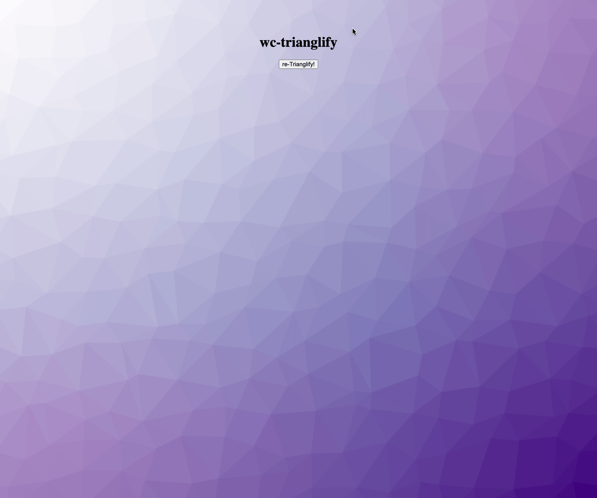

## WIP: `<wc-trianglify>`: A Web Component for [Trianglify](http://qrohlf.com/trianglify/)

### License

[`trianglify`](https://github.com/qrohlf/trianglify#%EF%B8%8F-licensing) has a GPL license, it's important for `wc-trianglify` to adhere to trianglify's license since `wc-trianglify` ships a copy of trianglify.  
`wc-trianglify` is subsequently also licensed as GPL 3.0.  
Any derivative work should be licensed in a compatible way.
